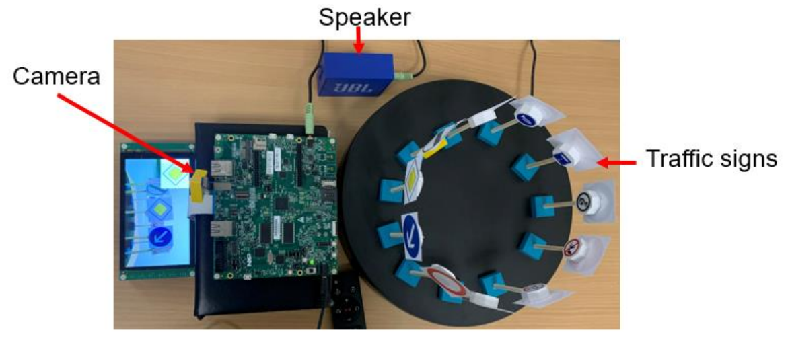

Overview
========
This demo leverages the capabilities of the NXP MIMXRT1170 development board to identify various traffic signs. On a turntable with a diameter of approximately 25 cm, arrange 11 distinct traffic signs. The rotation speed of the turntable can be adjusted using the remote control. A camera continuously captures photos, displaying the real-time content on the LCD screen.

The captured images undergo processing and are subsequently recognized by an AI system. The recognition results are promptly showcased in the upper left corner of the LCD, accompanied by the playback of corresponding audio through the audio system.

Storage Briefing
=====================

- As the storage device of the whole system, the total capacity of this Flash is 256Mb. Because the i.mxrt-1170 MCU has no internal flash, the code is stored in MX25LM51245G. The system will boot from MX25LM51245G in XIP mode. The content and size of the storage are shown as below.
- 

Hardware requirements
=====================

- Mini/micro USB cable
- EVK-MIMXRT1170 board
- RK055AHD091 display 
- OV5640 camera
- Speaker or audio system
- A turntable with a diameter of about 25 cm
- Personal computer (optional)

Prepare the Demo
================
1. Connect a USB cable between the host PC and the OpenSDA USB port on the target board. 
2. Either press the reset button on your board or launch the debugger in your IDE to begin running the demo.
3. Turn on the rotary table switch and use the remote control to adjust the direction and speed of rotation.

Running the demo
================
1. The rotary table rotates at a suitable speed.
2. The camera continuously captures traffic signs.
3. LCD displays the captured pictures in real time.
4. Adjust the distance between the target and the camera to ensure that the target can appear exactly in the flashing width in the middle of the LCD and can cover the entire box.
5. The system grabs the pictures in the LCD box and processes them into 128 * 128 pictures.
6. Input image data into AI neural network for recognition.
7. The predicted result will be displayed in the upper left corner of the LCD, and the speaker will play the predicted audio.

----------------------------------------